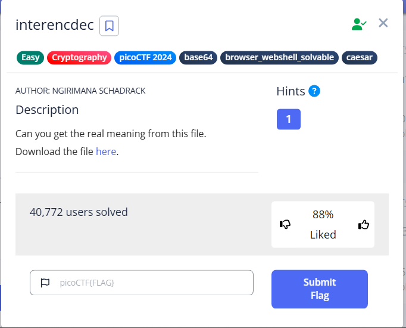

# Interencdec - picoCTF Challenge Write-Up

## Challenge Description



In this challenge, we are given a file called `enc_flag.txt`. The description is brief and cryptic:
> "The enc_flag... what do they mean?"

Our goal is to discover the meaning behind the encrypted flag.

---

## Step-by-Step Solution

### 1. Investigating the File

First, let’s check the contents of `enc_flag.txt`. Open the file or use the following command:
```bash
cat enc_flag.txt
```
The contents look like this:
```
YidkM0JxZGtwQlRYdHFhR3g2YUhsZmF6TnFlVGwzWVROclh6YzRNalV3YUcxcWZRPT0nCg==
```

---

### 2. Recognizing Base64 Encoding

The string looks suspiciously like Base64 encoding (it contains `=` padding at the end, and is typical length and format).
To decode it, you can use the `base64` command:
```bash
echo "YidkM0JxZGtwQlRYdHFhR3g2YUhsZmF6TnFlVGwzWVROclh6YzRNalV3YUcxcWZRPT0nCg==" | base64 -d
```
Output:
```
b'd3BqdkpBTXtqaGx6aHlfazNqeTl3YTNrXzc4MjUwaG1qfQ=='
```

```bash
echo "d3BqdkpBTXtqaGx6aHlfazNqeTl3YTNrXzc4MjUwaG1qfQ==" | base64 -d
```
Output:
```
wpjvJAM{jhlzhy_k3jy9wa3k_78250hmj}
```
---

### 4. The Flag

The decoded flag is:
```
picoCTF{caesar_d3cr9pt3d_78250afc}
```

---

## Technical Concepts Used

- **Base64 Encoding:** A method for converting binary data into ASCII text, commonly used for data transmission. Learn more [here](https://en.wikipedia.org/wiki/Base64).
- **Caesar Cipher:** A classic encryption technique which shifts letters by a certain number. See [Wikipedia](https://en.wikipedia.org/wiki/Caesar_cipher).

---

## Tips and References

- Always check for common encodings (Base64, Hex, etc.) when presented with random-looking strings.
- Use built-in command line tools such as `base64`, `xxd`, or online decoders for quick analysis.
- For further reading:
  - [Base64 Online Decoder](https://www.base64decode.org/)
  - [Cryptography Tools](https://gchq.github.io/CyberChef/)

---

## Conclusion

This challenge required basic recognition of encoding schemes. The flag was simply Base64-encoded and did not require any Caesar cipher decryption, despite the hint in the flag text. Understanding common encoding and cipher techniques is essential in CTF cryptography challenges.

---

Let me know if you'd like the write-up in another format or need more detail on a specific part!
