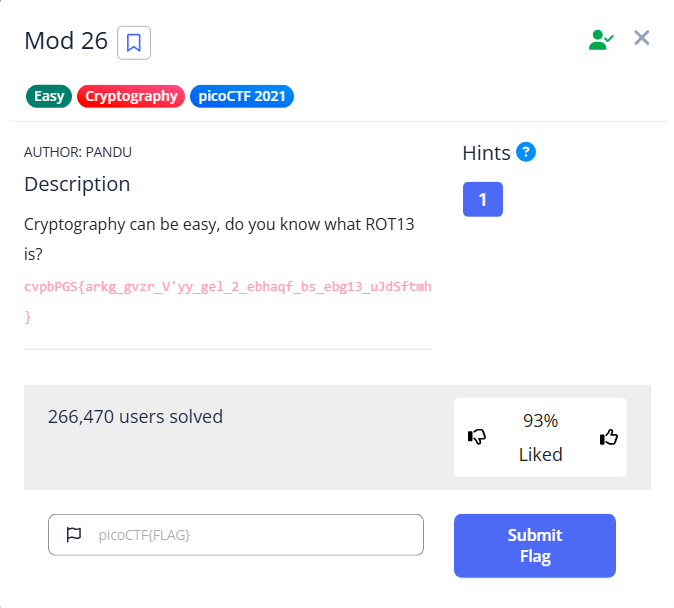

## Challenge

## Description
Cryptography can be easy, do you know what ROT13 is? cvpbPGS{arkg_gvzr_V'yy_gel_2_ebhaqf_bs_ebg13_uJdSftmh}

## Solving
First i search for what is ROT13 then i found the decoder online for rot 13 [dcode rot13](https://www.dcode.fr/rot-13-cipher) to solve it.

**Decoded flag: picoCTF{next_time_I'll_try_2_rounds_of_rot13_hWqFsgzu}**  
        
