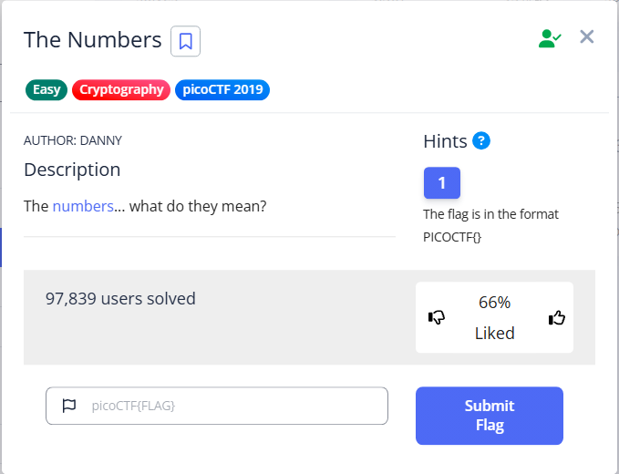

## Challenge

## Deskription
The [numbers](the_numbers.png)... what do they mean?

## Solving
I write the numbers from the picture "16 9 3 15 3 20 6 { 20 8 5 14 21 13 2 5 18 19 13 1 19 15 14 }" then when i saw the numbers i think its same with the normal alphabet A=1, so this is the flag: **picoCTF{THENUMBERSMASON}**
